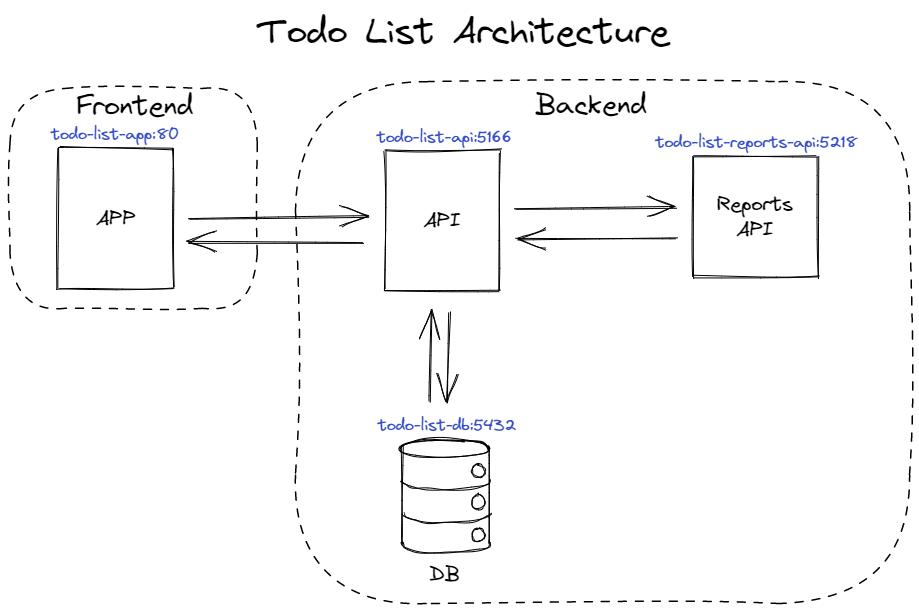

# mjr-todo-list

## Architecture



## Getting started

### Run on Docker Desktop

1. Build images todo-list-reports-api, todo-list-api and todo-list-app:

    ```
    docker build -t todo-list-reports-api ./src/todo-list-backend/TodoList.Reports.Api
    ```

    ```
    docker build -t todo-list-api ./src/todo-list-backend/TodoList.Api
    ```

    ```
    docker build -t todo-list-app ./src/todo-list-frontend
    ```

2. Create network todo-list-network:

    ``` 
    docker network create todo-list-network
    ```

3. Create volumes todo-list-reports-volume and todo-list-db-volume:

   ```
   docker volume create todo-list-reports-volume
   ```
   
   ```
   docker volume create todo-list-db-volume
   ```

3. Run containers todo-list-db, todo-list-reports-api, todo-list-api and todo-list-app:

    ```
    docker run --name todo-list-db -e POSTGRES_PASSWORD=password -e PGDATA=/var/lib/postgresql/data/pgdata -v todo-list-db-volume:/var/lib/postgresql/data -d --net todo-list-network postgres:15.0-alpine
    ```

    ```
    docker run --name todo-list-reports-api -d --net todo-list-network todo-list-reports-api
    ```

    ```
    docker run --name todo-list-api -e Database__Provider=Postgres -e Database__ConnectionString="Host=todo-list-db:5432;Username=postgres;Password=password;Database=postgres" -e Reports__Address=http://todo-list-reports-api:5218 -e Reports__Path=/todo-reports -v todo-list-reports-volume:/todo-reports -dp 5166:5166 --net todo-list-network todo-list-api
    ```

    ```
    docker run --name todo-list-app -dp 8080:80 --net todo-list-network todo-list-app
    ```

### Run on Docker Desktop using Docker Compose

...

### Run on Docker Desktop using Kubernetes

...